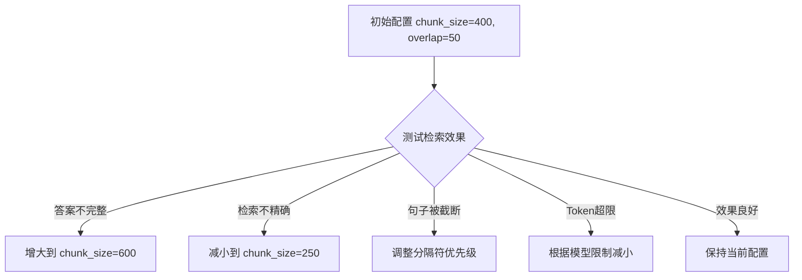
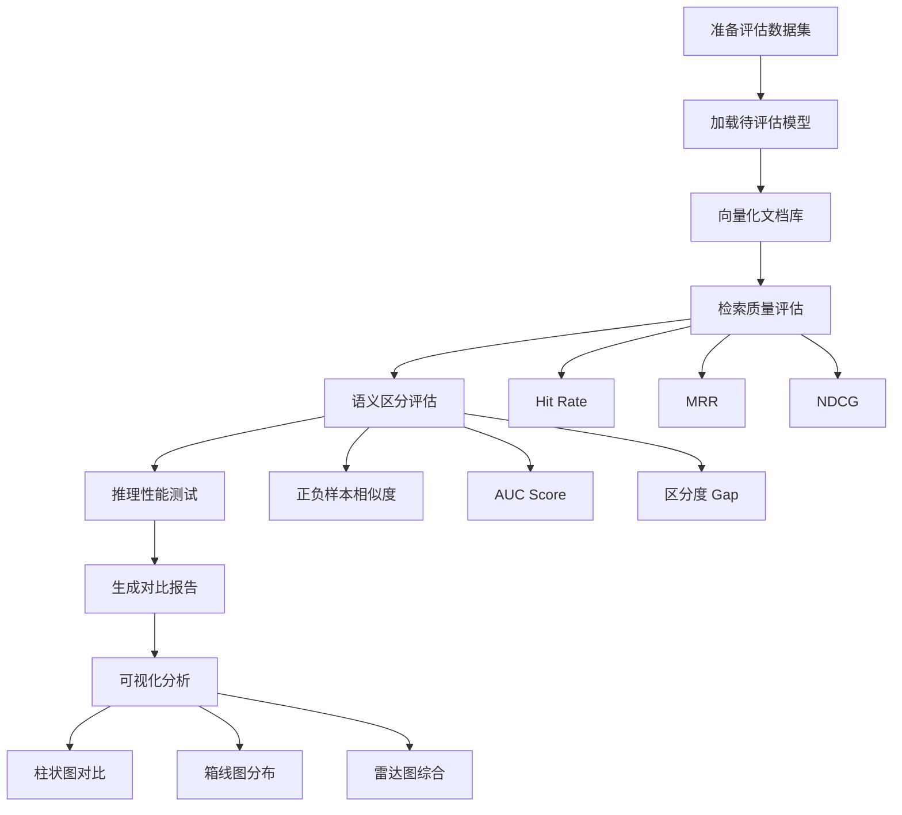

#!/usr/bin/env python3
# -*- coding: utf-8 -*-
"""
阶段二：数据处理与向量化
目标：掌握高质量数据处理和向量化方法
"""

"""
学习目标：
1. 掌握多格式文档解析技术
2. 实现文本清洗和标准化
3. 掌握多种文档分块策略
4. 深入理解Embedding模型
5. 搭建向量数据库

测试标准：
- 能解析PDF/HTML/Markdown/Word文档
- 分块质量提升30%以上
- 向量化准确率>95%
- 向量数据库CRUD操作流畅
- 批量向量化性能优化

关键技能：
- 文档解析器选择和使用
- 分块策略设计
- Embedding模型对比
- 向量数据库选型
- 批量处理优化
"""


# ==================== 1. 文档解析技术 ====================
"""
支持的文档格式：
1. PDF：pypdf, pdfplumber, PyPDF2
2. HTML：beautifulsoup4, lxml
3. Markdown：markdown
4. Word：python-docx
5. Excel：openpyxl, pandas
6. PowerPoint：python-pptx
7. TXT：内置open()

解析注意事项：
- 保留文档结构（标题、段落、列表等）
- 提取表格数据
- 处理图片（OCR）
- 保留元数据（作者、日期、来源）
"""


# ==================== 2. 文本清洗 ====================
"""
文本清洗步骤：
1. 去除特殊字符（保留中文、英文、数字、常用标点）
2. 统一空白字符（多个空格→一个空格）
3. 去除HTML标签（如果有）
4. 处理编码问题
5. 统一标点符号（全角/半角）

清洗原则：
- 保留语义信息
- 适度清洗，不过度
- 考虑Embedding模型的特性
- 保留必要的格式信息
"""


# ==================== 3. 文档分块策略 ====================
"""
策略1：固定大小分块（Fixed Size Chunking）
- 优点：简单易实现，计算效率高
- 缺点：可能切断语义，上下文丢失
- 适用：通用文档，对语义要求不高的场景
- 参数：chunk_size, chunk_overlap

策略2：语义分块（Semantic Chunking）
- 优点：保持语义完整性
- 缺点：计算复杂，需要额外模型
- 适用：长文档，需要保持语义的场景
- 方法：基于句子相似度、段落结构

策略3：基于结构的分块（Structure-based Chunking）
- 优点：保留文档逻辑结构
- 缺点：依赖文档格式
- 适用：结构化文档（Markdown、HTML）
- 方法：基于标题、段落、章节

策略4：递归分块（Recursive Chunking）
- 优点：灵活，适应性强
- 缺点：需要设计递归规则
- 适用：复杂文档，多层次结构

分块质量评估：
- 语义完整性（使用句子相似度）
- 信息完整性（关键信息是否保留）
- 上下文连贯性（Chunk之间的连贯性）

推荐策略：
- 短文档：固定大小分块
- 长文档：递归分块
- 结构化文档：基于结构的分块
- 高精度需求：语义分块
"""


## 📊 中文分块参数推荐

### 中文 vs 英文的关键差异

| 特性 | 英文 | 中文 |
|------|------|------|
| 信息密度 | 低（1字符≈0.25词） | **高（1字符≈1词）** |
| Token 比例 | 1词≈1-2 tokens | **1字≈2-3 tokens** |
| 分隔符 | 空格、句号 | **句号、逗号、分号** |
| 同等语义所需字符数 | 多 | **少** |

### 🎯 中文推荐配置

| 场景 | chunk_size | chunk_overlap | 说明 |
|------|------------|---------------|------|
| **通用问答** | **300-500** | **30-50** | 平衡精度和语义 |
| **高精度检索** | **150-300** | **20-30** | 短文本精准匹配 |
| **长文档/报告** | **500-800** | **80-100** | 保持段落完整 |
| **新闻/文章** | **400-600** | **50-80** | 保持句子完整 |
| **法律/合同** | **200-400** | **40-60** | 条款级别分割 |

## ✅ 中文最佳实践配置

```python
from langchain_text_splitters import RecursiveCharacterTextSplitter

# 推荐配置：中文通用
chinese_splitter = RecursiveCharacterTextSplitter(
    chunk_size=400,          # 中文400字符 ≈ 英文1000字符的信息量
    chunk_overlap=50,        # 约12%重叠
    separators=[
        "\n\n",              # 1. 段落（最优先）
        "\n",                # 2. 换行
        "。",                # 3. 句号（中文句子结束）
        "！",                # 4. 感叹号
        "？",                # 5. 问号
        "；",                # 6. 分号（分句）
        "，",                # 7. 逗号（子句）
        " ",                 # 8. 空格
        ""                   # 9. 字符级别（兜底）
    ],
    length_function=len,
    keep_separator=True      # 保留分隔符，保持句子完整
)
```

## 📋 不同场景的具体配置

### 1. 问答系统（高精度）
```python
qa_splitter = RecursiveCharacterTextSplitter(
    chunk_size=300,
    chunk_overlap=30,
    separators=["。", "！", "？", "\n", "；", "，", ""],
    keep_separator=True
)
```

### 2. 知识库/文档检索
```python
doc_splitter = RecursiveCharacterTextSplitter(
    chunk_size=500,
    chunk_overlap=80,
    separators=["\n\n", "\n", "。", "！", "？", "；", "，", ""],
    keep_separator=True
)
```

### 3. 长文本摘要
```python
summary_splitter = RecursiveCharacterTextSplitter(
    chunk_size=800,
    chunk_overlap=100,
    separators=["\n\n", "\n", "。", ""],
    keep_separator=True
)
```

## 🔑 中文分块的注意事项

### 1. Token 限制换算

```
中文字符数 × 2~3 ≈ Token数

例如：
- chunk_size=400 中文字符 ≈ 800-1200 tokens
- Embedding模型限制512 tokens → chunk_size建议 ≤ 200字符
```

### 2. 常见 Embedding 模型的中文配置

| 模型 | 最大 Token | 推荐中文 chunk_size |
|------|-----------|-------------------|
| OpenAI text-embedding-3-small | 8191 | ≤ 2000 字符 |
| BGE-large-zh | 512 | **≤ 200 字符** |
| M3E-base | 512 | **≤ 200 字符** |
| text2vec-chinese | 512 | **≤ 200 字符** |
| Sentence-transformers | 256-512 | **≤ 150 字符** |

### 3. 分隔符优先级（中文优化）

```python
# 中文分隔符优先级（从高到低）
separators = [
    "\n\n",    # 段落分隔
    "\n",      # 行分隔
    "。",      # 句号 - 句子结束
    "！",      # 感叹号
    "？",      # 问号
    "；",      # 分号 - 并列分句
    "……",     # 省略号
    "，",      # 逗号 - 子句
    "、",      # 顿号 - 并列词
    " ",       # 空格
    ""         # 字符级别
]
```

## 📈 中文分块调优流程



## 📝 中文参数总结

| 参数 | 推荐值 | 范围 | 说明 |
|------|--------|------|------|
| **chunk_size** | **400** | 200-600 | 中文信息密度高，比英文小 |
| **chunk_overlap** | **50** (12%) | 30-100 | 保持句子上下文 |
| **分隔符** | 见上文 | - | 优先按中文标点分割 |
| **keep_separator** | **True** | - | 保留标点，句子更完整 |

**核心原则**：
1. 中文 chunk_size 一般是英文的 **40%-60%**
2. 优先按中文标点（句号、问号、感叹号）分割
3. 使用国产 Embedding 模型时注意 512 token 限制
4. 开启 `keep_separator=True` 保持句子完整性


# ==================== 4. Embedding模型对比 ====================
"""
模型选择标准：
1. 性能（准确率）
2. 速度（延迟）
3. 维度（存储成本）
4. 语言支持
5. 模型大小
6. 部署难度

主流模型对比：

OpenAI text-embedding-3-small:
- 维度：1536
- 语言：多语言
- 性能：高
- 速度：中（API调用）
- 优点：性能好，易用
- 缺点：依赖API，成本高
- 适用：生产环境，追求性能

OpenAI text-embedding-3-large:
- 维度：3072
- 语言：多语言
- 性能：很高
- 速度：慢（API调用）
- 优点：性能最好
- 缺点：成本高，速度慢
- 适用：高精度需求

sentence-transformers/all-MiniLM-L6-v2:
- 维度：384
- 语言：多语言
- 性能：中高
- 速度：快（本地部署）
- 优点：轻量，快速，免费
- 缺点：性能略低于OpenAI
- 适用：资源受限，快速原型

bge-large-en-v1.5:
- 维度：1024
- 语言：英文为主
- 性能：高
- 速度：中（本地部署）
- 优点：性能好，开源
- 缺点：仅支持英文
- 适用：英文场景

bge-large-zh-v1.5:
- 维度：1024
- 语言：中文
- 性能：高
- 速度：中（本地部署）
- 优点：中文性能好
- 缺点：仅支持中文
- 适用：中文场景

m3e-base:
- 维度：768
- 语言：中英双语
- 性能：中高
- 速度：中
- 优点：双语支持，开源
- 缺点：性能中等
- 适用：中英双语场景

推荐方案：
- 通用场景：OpenAI text-embedding-3-small
- 中文场景：bge-large-zh-v1.5
- 资源受限：all-MiniLM-L6-v2
- 高精度：text-embedding-3-large
"""


## ==================== Embedding 模型效果评估 ====================

### 评估维度

为了科学地选择合适的 Embedding 模型，需要从多个维度进行评估：

#### 1️⃣ 检索质量指标

| 指标 | 含义 | 计算方式 | 优秀标准 |
|------|------|----------|----------|
| **Hit Rate@K** | Top-K 结果中命中相关文档的比例 | 如果任一相关文档在 Top-K 中则为 1 | Hit@1 > 70%, Hit@3 > 90% |
| **MRR** | Mean Reciprocal Rank，第一个相关文档排名的倒数 | 1 / 第一个相关文档的排名 | MRR > 0.7 |
| **NDCG@K** | 归一化折损累计增益，考虑排序位置 | DCG / Ideal DCG | NDCG@3 > 0.8 |
| **Precision@K** | Top-K 结果中相关文档的比例 | 相关文档数 / K | Precision@5 > 60% |
| **Recall@K** | Top-K 结果召回的相关文档比例 | 召回相关文档数 / 总相关文档数 | Recall@5 > 80% |

**解读**：
- Hit Rate@K 关注是否检索到，不关注排序
- MRR 关注第一个相关文档的位置（越靠前越好）
- NDCG@K 同时关注召回和排序质量

#### 2️⃣ 语义区分能力

| 指标 | 含义 | 优秀标准 |
|------|------|----------|
| **正样本平均相似度** | 相似文本对的平均相似度 | 越高越好 |
| **负样本平均相似度** | 不相似文本对的平均相似度 | 越低越好 |
| **区分度（Gap）** | 正负样本相似度的差值 | Gap > 0.4 |
| **AUC Score** | ROC 曲线下面积，反映分类能力 | AUC > 0.85 |

**评估方法**：
准备正负样本对，计算余弦相似度，统计正负样本的分布差异。

**解读**：
- 正样本相似度高 + 负样本相似度低 = 强语义区分能力
- AUC > 0.5 表示模型有效，越接近 1 越好

#### 3️⃣ 推理性能

| 指标 | 含义 | 优秀标准 |
|------|------|----------|
| **单次延迟** | 处理单个文本的时间 | < 100ms (CPU), < 20ms (GPU) |
| **吞吐量** | 每秒处理文本数 | > 100 texts/s (CPU), > 500 texts/s (GPU) |
| **批量延迟** | 处理一批文本的平均时间 | 越低越好 |

**测试方法**：
使用不同批次大小（1, 8, 32）测试，找到最佳性能配置。

### 评估流程



### 评估数据集设计

#### 文档库
构建包含 15-20 个高质量文档片段的知识库，涵盖：
- 技术概念定义
- 工具和框架介绍
- 最佳实践建议
- 常见问题解答

#### 查询集
每个查询包含：
- 查询文本
- 相关文档 ID 列表（人工标注）
- 查询分类（可选）

**示例**：
```python
{
    "query": "什么是RAG技术？它有什么作用？",
    "relevant_docs": ["doc_1", "doc_6"],
    "category": "基础概念"
}
```

#### 语义样本对
准备正负样本对，格式：`(文本1, 文本2, 标签)`

- 正样本对（label=1）：语义相似的文本
- 负样本对（label=0）：语义不相似的文本

**示例**：
```python
# 正样本
("RAG技术可以减少大模型幻觉", "检索增强生成有助于提升回答准确性", 1)

# 负样本
("RAG技术用于增强检索", "今天天气很好适合出门", 0)
```

### 评估脚本使用

#### 运行评估

```bash
python phase2_vectorization/test_embedding_evaluation.py
```

#### 输出内容

1. **控制台输出**
   - 每个模型的详细指标
   - 模型对比总结
   - 综合评分排名
   - 推荐结论

2. **可视化图表**（保存在 `eval_results` 目录）
   - `embedding_comparison.png` - 检索质量对比
   - `auc_comparison.png` - AUC 指标对比
   - `similarity_distribution.png` - 相似度分布箱线图
   - `radar_comparison.png` - 综合性能雷达图

#### 模型配置

在脚本中配置待评估的模型：

```python
EMBEDDING_MODELS = [
    EmbeddingModelConfig(
        name="bge-large-zh",
        model_id="BAAI/bge-large-zh-v1.5",
        description="BGE-large-zh (北京智源, 1024维)",
        max_seq_length=512
    ),
    # ... 添加更多模型
]
```

### 评估结果解读

#### 综合评分计算

```python
综合得分 = 检索得分 × 50% + 语义得分 × 30% + 性能得分 × 20%

其中：
- 检索得分 = Hit@1×0.3 + Hit@3×0.2 + MRR×0.3 + NDCG@3×0.2
- 语义得分 = AUC Score
- 性能得分 = 相对吞吐量（归一化）
```

#### 选择建议

根据场景选择：

| 场景 | 优先指标 | 推荐模型特征 |
|------|----------|-------------|
| **高精度问答** | Hit@1, MRR, AUC | 综合得分高，检索质量好 |
| **大规模检索** | 吞吐量, Hit@3 | 速度快，批量处理能力强 |
| **语义理解** | 区分度 Gap, AUC | 语义区分能力强 |
| **资源受限** | 延迟, 模型大小 | 轻量模型，推理快 |

#### 常见问题

**Q1: Hit Rate 高但 MRR 低，说明什么？**
A: 说明能检索到相关文档，但排名靠后，需要优化检索策略或模型排序能力。

**Q2: AUC 高但实际检索效果不好？**
A: 可能是评估数据集与实际场景分布不一致，需要调整数据集。

**Q3: 如何选择模型维度？**
A: 高维度（1024+）- 精度高但存储大；低维度（384-768）- 平衡性能和成本。

### 评估最佳实践

1. **数据集构建**
   - 覆盖实际应用场景
   - 确保标注质量（多人交叉验证）
   - 数据量不少于 15 个文档、10 个查询

2. **评估指标组合**
   - 不只看单一指标
   - 结合业务场景调整权重
   - 关注最短板（瓶颈指标）

3. **多次评估**
   - 不同的数据切分
   - 多个随机种子
   - 计算指标的标准差

4. **持续监控**
   - 上线后持续跟踪实际效果
   - 根据用户反馈调整
   - 定期重新评估新模型


# ==================== 5. 向量数据库 ====================
"""
向量数据库选择标准：
1. 性能（查询速度）
2. 准确性（召回率）
3. 可扩展性（数据规模）
4. 易用性（部署难度）
5. 功能丰富度
6. 成本

主流向量数据库对比：

Chroma:
- 开源：是
- 性能：中
- 易用性：高
- 特点：简单易用，Python原生
- 适用：快速原型，小规模应用

FAISS:
- 开源：是
- 性能：高
- 易用性：中
- 特点：Facebook开发，高性能
- 适用：大规模检索，性能敏感场景

Pinecone:
- 开源：否
- 性能：高
- 易用性：高
- 特点：云服务，托管式
- 适用：生产环境，不想维护

Milvus:
- 开源：是
- 性能：高
- 易用性：中
- 特点：功能丰富，企业级
- 适用：企业级应用

Weaviate:
- 开源：是
- 性能：高
- 易用性：中高
- 特点：GraphQL API，模块化设计
- 适用：需要丰富功能的场景

推荐方案：
- 学习原型：Chroma
- 性能优化：FAISS
- 生产环境：Pinecone 或 Milvus
"""


# ==================== 6. 批量向量化优化 ====================
"""
优化策略：
1. 批量处理（Batch Processing）
   - 一次性处理多个文档
   - 减少API调用次数
   - 提高GPU利用率

2. 并行处理（Parallel Processing）
   - 多进程/多线程
   - 使用Joblib、concurrent.futures
   - 充分利用多核CPU

3. GPU加速（GPU Acceleration）
   - 使用CUDA
   - 支持的模型：sentence-transformers
   - 性能提升：5-10倍

4. 缓存机制（Caching）
   - 缓存已向量化的文档
   - 避免重复计算
   - 使用磁盘缓存

5. 增量更新（Incremental Update）
   - 只处理新文档
   - 减少重复工作
   - 提高效率

性能指标：
- 吞吐量（文档/秒）
- 延迟（毫秒）
- CPU/GPU使用率
- 内存占用

目标性能：
- 批量向量化：>1000文档/分钟（CPU）
- 批量向量化：>5000文档/分钟（GPU）
- 单个文档：<100ms
"""


# ==================== 7. 实践任务清单 ====================
"""
基础任务：
□ 2.1 实现PDF文档解析
□ 2.2 实现HTML/Markdown文档解析
□ 2.3 实现Word文档解析
□ 2.4 实现文本清洗函数
□ 2.5 实现固定大小分块
□ 2.6 实现语义分块
□ 2.7 实现递归分块
□ 2.8 对比分块策略质量
□ 2.9 对比多个Embedding模型
□ 2.10 搭建Chroma向量数据库
□ 2.11 实现向量CRUD操作
□ 2.12 实现批量向量化
□ 2.13 实现并行处理
□ 2.14 实现GPU加速（如果有GPU）
□ 2.15 实现缓存机制

进阶任务：
□ 2.16 实现文档去重
□ 2.17 实现元数据管理
□ 2.18 实现增量更新
□ 2.19 实现质量评估
□ 2.20 性能测试和优化

测试验证：
□ 2.21 解析准确率>95%
□ 2.22 分块质量提升30%
□ 2.23 向量化准确率>95%
□ 2.24 批量处理性能达标
□ 2.25 向量数据库响应<100ms

参考资料：
- LangChain文档: https://python.langchain.com/docs/modules/data_connection/document_loaders/
- ChromaDB文档: https://docs.trychroma.com/
- FAISS文档: https://faiss.ai/
- Sentence-Transformers: https://www.sbert.net/
"""

print("阶段二：数据处理与向量化")
print("=" * 60)
print("\n学习目标：")
print("1. 掌握多格式文档解析")
print("2. 实现高质量文本清洗")
print("3. 掌握多种分块策略")
print("4. 对比和选择Embedding模型")
print("5. 搭建向量数据库")

print("\n关键技术：")
print("- 文档解析器")
print("- 文本清洗")
print("- 分块策略")
print("- Embedding模型")
print("- 向量数据库")
print("- 批量处理")

print("\n实践任务：")
print("请参考本目录下的测试代码，完成所有任务")
print("注意对比不同策略的效果差异")
